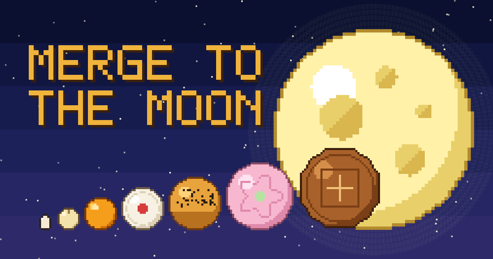

# 🌕 月餅合成 Merge to the Moon

從芝麻開始，兩個一樣的碰在一起就合成更大的，一路合成到月亮的中秋像素風物理小遊戲。



## Demo

**▶ https://meowmeowmeowcute.github.io/merge-to-the-moon/**

手機、電腦的瀏覽器打開就能玩（手機建議直式）。

## 玩法

- 左右滑動（或滑鼠移動、鍵盤 ← →）瞄準，放開（或點擊、空白鍵）投放。
- 每次隨機掉下第 1～5 階的物件，**兩個相同的物件碰在一起就合成高一階**，合成時會帶著慣性往上彈一下，並把周圍推開。
- 合成階級（共 8 次合成才到月亮）：

  芝麻 → 蓮子 → 蛋黃 → 綠豆椪 → 蛋黃酥 → 冰皮月餅 → 廣式月餅 → 柚子 → 🌕 月亮

- 物件停在上方虛線以上超過 2 秒就結束。結束後可以「再一局」或「分享」分數。
- **難度隨分數上升**：200 / 500 / 1000 分時升級（Lv.2～Lv.4），掉下來的物件越來越大、超線容許時間縮短到 1.2 秒。
- `P` / `Esc` 暫停，右上角可以靜音。最高分會記在瀏覽器裡。

## Development

需要 [Node.js](https://nodejs.org/) 20 以上（只用來跑測試和本機伺服器，遊戲本身**沒有 build step**）。

```bash
npm install        # 安裝 devDependency（matter-js，給測試用）
npm test           # 執行全部測試（Node 內建 node --test）
npm run serve      # 本機預覽 http://localhost:8080（被佔用時自動換下一個 port）
```

其他指令：

```bash
npm run vendor               # 從 node_modules 複製 matter.min.js 到 src/vendor/
node scripts/make-images.mjs # 重新產生 src/og.png、src/favicon.png
```

除錯：網址加上 `?debug`，可以在 console 用 `__game` 直接擺放物件、快轉時間。

### 部署

push 到 `main` 後，GitHub Actions（[.github/workflows/deploy.yml](.github/workflows/deploy.yml)）會先跑 `npm test`，**測試通過才**把 `src/` 部署到 GitHub Pages。

### 技術與架構

- 原生 **HTML / CSS / JavaScript（ES Modules）**，不用框架、不用打包工具。
- **Matter.js 0.20** 處理物理（瀏覽器端放在 `src/vendor/`，不依賴 CDN）；畫面用 Canvas 2D 自己畫，不使用 Matter.Render。
- 像素圖由程式產生（`src/render/sprites.js`），並用測試保證外形和碰撞圓的誤差 ≤ 1 格。
- 音效用 WebAudio 即時合成，不載入音檔。

```text
src/
├── index.html / style.css / main.js   # 頁面、輸入、主迴圈、UI
├── audio.js                           # 音效
├── game/                              # 純邏輯（不碰 DOM，可在 Node 測試）
│   ├── config.js    階級表與常數
│   ├── game.js      狀態機、固定步長、投放、計分、Game Over
│   ├── world.js     Matter 容器與物件
│   ├── merge.js     合成、彈跳與推開
│   ├── spawner.js / rng.js / rules.js / storage.js / share.js
└── render/                            # 畫面
    ├── sprites.js   像素圖產生
    ├── renderer.js  Canvas 繪製
    └── effects.js   粒子、閃光圈、飄字、月亮慶祝
tests/                                 # 90 個測試：物理、合成、規則、像素圖、分享
```

### 開發方法

- **SDD**：先寫 [SPEC.md](SPEC.md)（功能、系統行為、Acceptance Criteria、Non-goals），需求改動時先改 Spec 再改程式。整體目標見 [PROJECT_GOAL.md](PROJECT_GOAL.md)。
- **TDD**：先寫會失敗的測試（Red）→ 實作（Green）→ 重構。物理測試用 headless Matter 引擎加固定步長和 seed，結果可重現。
- 開發過程中 AI 出錯的紀錄在 [docs/ai-incidents.md](docs/ai-incidents.md)，回顧在 [RETROSPECTIVE.md](RETROSPECTIVE.md)。

## AI Tools

- **Claude Code**（Claude 桌面版的 Code 分頁，模型 Claude Opus 5.5）：撰寫 Spec 與測試、實作、除錯、在內建瀏覽器中驗證畫面、用 `gh` 建立 repo 與部署。
- 人負責：訂需求與遊戲規則、Review Spec / 測試 / diff、試玩並提出調整（例如拿掉下一個預覽、加入合成彈跳、提高難度並加入難度等級）、決定何時 commit 與部署。
